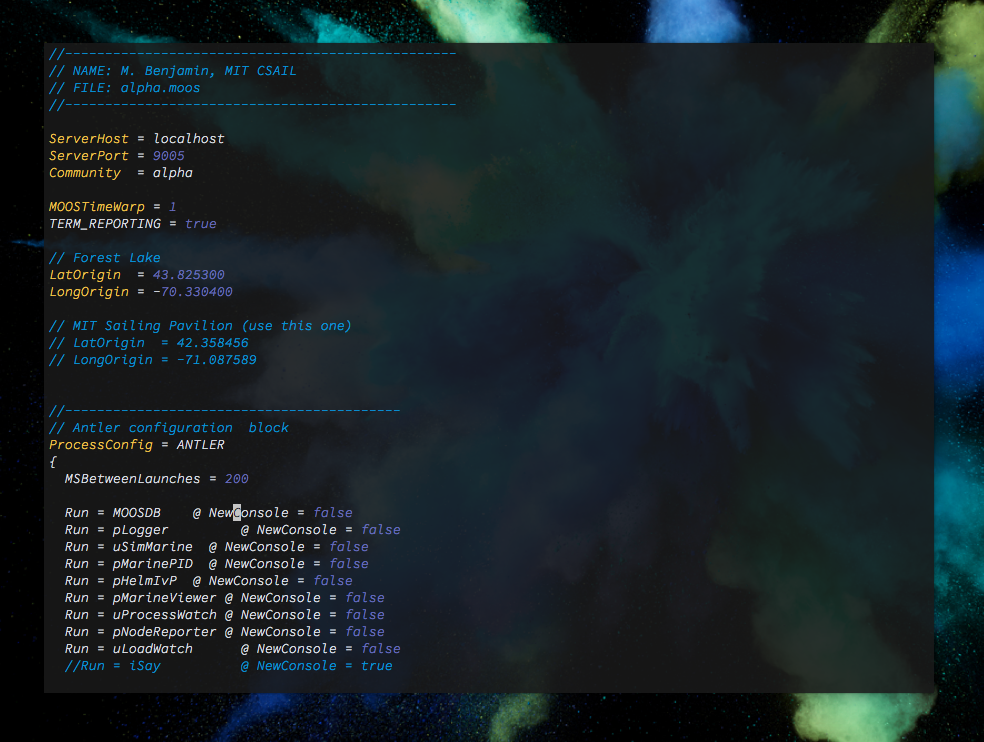

# moos-vim-syntax

> A vim package which adds syntax highlighting for MOOS-IvP mission files (those with extensions `.moos` or `.bhv`).

## Installation

Use your favorite plugin manager.

- [NeoBundle][neobundle]

    ```vim
    NeoBundle 'darfink/vim-plist'
    ```

- [Vundle][vundle]

    ```vim
    Bundle 'darfink/vim-plist'
    ```

- [Pathogen][pathogen]

    ```sh
    git clone git://github.com/darfink/vim-plist.git ~/.vim/bundle/vim-plist
    ```

- [vim-plug][vim-plug]

    ```vim
    Plug 'darfink/vim-plist'
    ```

## Usage

None! Simply open a MOOS mission or behavior file.

## License

Provided under the [MIT License](LICENSE).

[neobundle]: https://github.com/Shougo/neobundle.vim
[vundle]: https://github.com/gmarik/vundle
[pathogen]: https://github.com/tpope/vim-pathogen
[vim-plug]: https://github.com/junegunn/vim-plug
